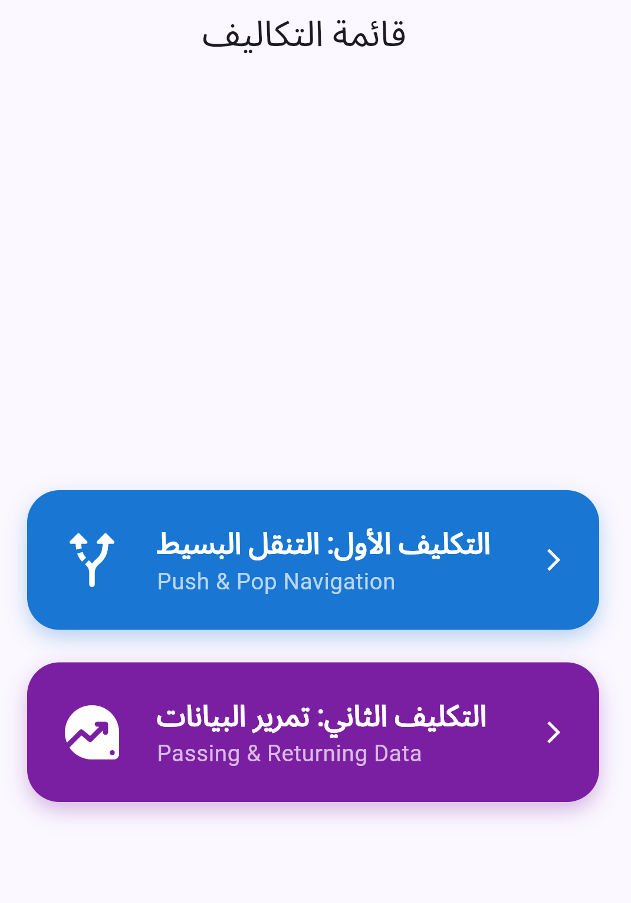
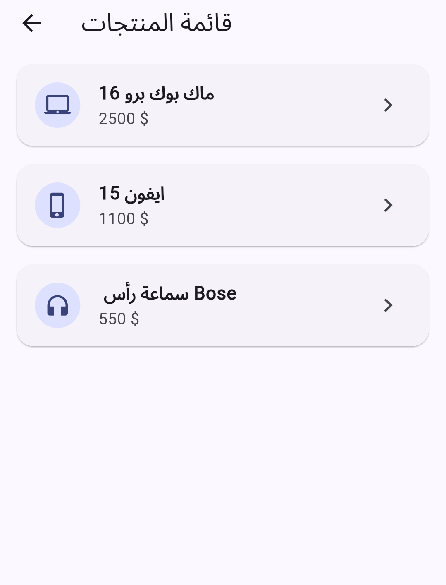
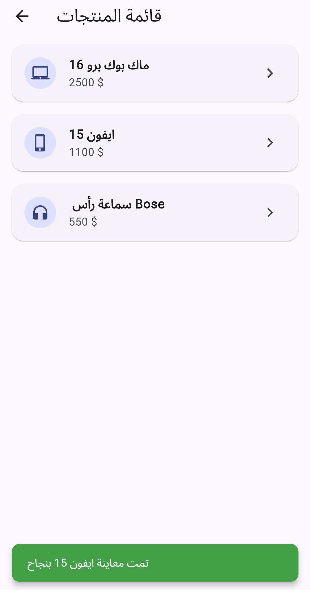

# حل تكليف المحاضرة الخامسة (التنقل وتمرير البيانات) 

هذا المستودع يحتوي على حل التكليف العملي للمحاضرة الخامسة تحت إشراف **المهندس عمر الساكت**، والذي يغطي مفاهيم التنقل (Navigation) وتمرير البيانات بين الشاشات في Flutter.

---

## 📱 القائمة الرئيسية للتطبيق
شاشة الانطلاق التي تسمح بالدخول إلى التمرينين:

  

---

##  التمرين الأول: Basic Stack Navigation
شرح آليات التنقل البسيط باستخدام الـ Push والـ Pop بين الشاشة الرئيسية وشاشة التفاصيل.

| الشاشة الرئيسية للتمرين | شاشة التفاصيل (بعد الـ Push) |
| :---: | :---: |
|  |  |

---

##  التمرين الثاني: Passing and Returning Data
شرح عملية تمرير كائن (Product Object) إلى شاشة التفاصيل، وإرجاع رسالة تأكيد ليتم عرضها في SnackBar.

### 1. قائمة المنتجات وتمرير البيانات
تعرض هذه الشاشة قائمة بالمنتجات، وعند الضغط على أي منتج يتم تمرير بياناته (الاسم، الوصف، السعر) إلى الشاشة التالية.

  

### 2. شاشة تفاصيل المنتج المستلمة للبيانات
تستقبل هذه الشاشة البيانات الممررة وتعرضها بشكل كامل، وتحتوي على زر "رجوع مع تأكيد".

  

### 3. إرجاع البيانات وعرض الـ SnackBar
عند الضغط على زر الرجوع، يتم إرسال رسالة نصية واستقبالها في الشاشة السابقة وعرضها داخل SnackBar احترافي.

  

---

##  تقنيات التنفيذ
- **Framework**: Flutter (Material 3)
- **Navigation**: Navigator (Push/Pop)
- **Data Handling**: Passing Objects & Async/Await for results
